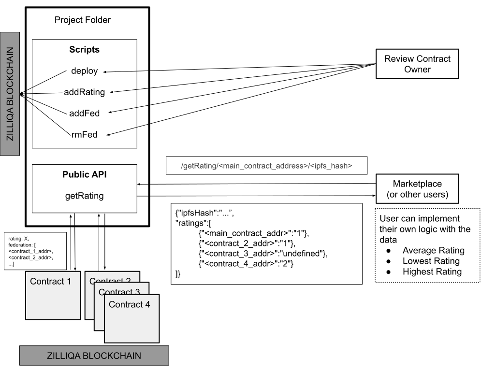

# Review Federation POC

## Set-up
```
git clone git@github.com:iangohy/zilliqa-review-federation-poc.git
cd zilliqa-review-federation-poc
yarn install
yarn start
```

To listen on other ports
```
PORT=8888 yarn start
```

## Overview

## Usage
### Recommendations
Add `PRIVATE_KEY` and `CONTRACT_ADDRESS` to .env file at the root of the project folder. Additional required environmental variables can be prepended to the desired commands. Examples shown assume that `PRIVATE_KEY` and `CONTRACT_ADDRESS` have been added to .env file or already exists as an environment variable.
### Get Rating
Get rating of the file with specified IPFS hash. Ratings will be extracted from all contracts in the federation.
```
/getRating/<smart_contract_address>/<ipfs_hash>
```
Example: http://localhost:3000/getRating/0x6e3d093864Ee51C691d68447Afe9fdC38c025866/Qmd286K6pohQcTKYqnS1YhWrCiS4gz7Xi34sdwMe9USZ7u

### Deploy Smart Contract
Deploy a new review smart contract. Owner immutable field will be set to the public key of the wallet deploying the contract.
```
PRIVATE_KEY=xxxx yarn deploy
```
Example: 
```
yarn deploy
```
### Add Rating
Add specified rating given the IPFS hash of a file.
```
PRIVATE_KEY=xxxx CONTRACT_ADDRESS=xxxx IPFS_HASH=Qxxxx RATING=x yarn addRating
```
Example: 
```
IPFS_HASH=Qmd286K6pohQcTKYqnS1YhWrCiS4gz7Xi34sdwMe9USZ7u RATING=1 yarn addRating
```

### Add to Federation
Add another review smart contract to the federation. Rating from all other contracts in the federation will be returned when getRating is called.
```
PRIVATE_KEY=xxxx CONTRACT_ADDRESS=xxxx ADD_CONTRACT_ADDRESS=xxxx yarn addFed
```
Example:
```
ADD_CONTRACT_ADDRESS=0x5a53a64d5076b36845b7a97354e346051fc74d96 yarn addFed
```

### Remove from Federation
Remove existing review smart contract from the federation.
```
PRIVATE_KEY=xxxx CONTRACT_ADDRESS=xxxx RM_CONTRACT_ADDRESS=xxxx yarn rmFed
```
Example:
```
RM_CONTRACT_ADDRESS=0x5a53a64d5076b36845b7a97354e346051fc74d96 yarn rmFed
```

## Run Development Server
```
yarn dev
```

## Testing Data
### IPFS
Cat Picture IPFS Hash
```
Qmd286K6pohQcTKYqnS1YhWrCiS4gz7Xi34sdwMe9USZ7u
```

### Contracts
Main Contract
```
0x6e3d093864Ee51C691d68447Afe9fdC38c025866
```

Secondary Contracts (federation)
```
0x5a53a64d5076b36845b7a97354e346051fc74d96
0xfb079782bf674fe8649348dbfd1db312097744c3
0x9a97d7412f30c194bd1ee2565953f558bb9adfda
```